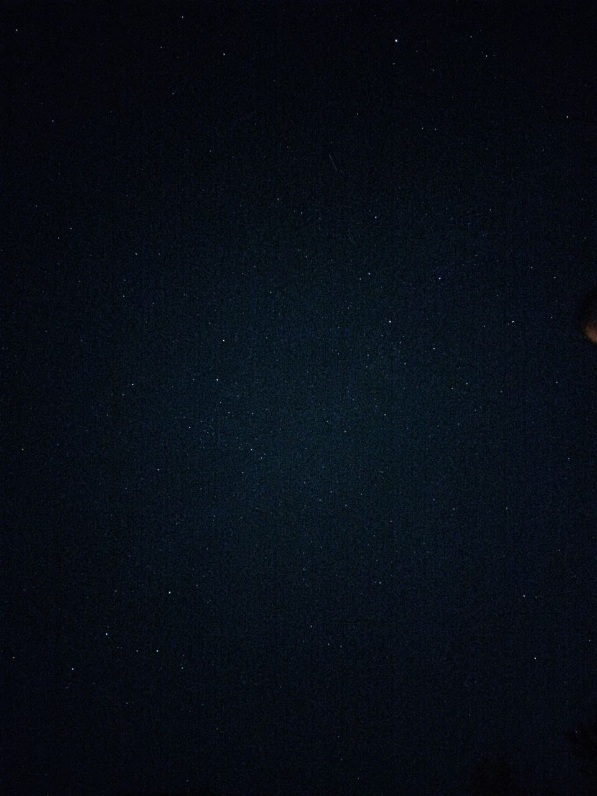
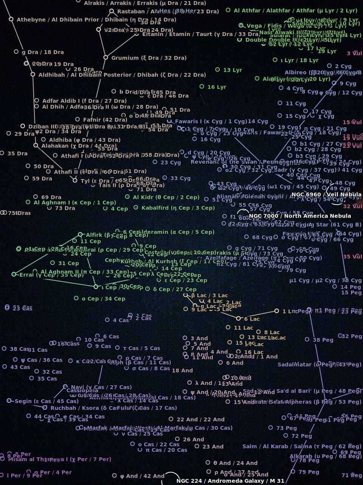
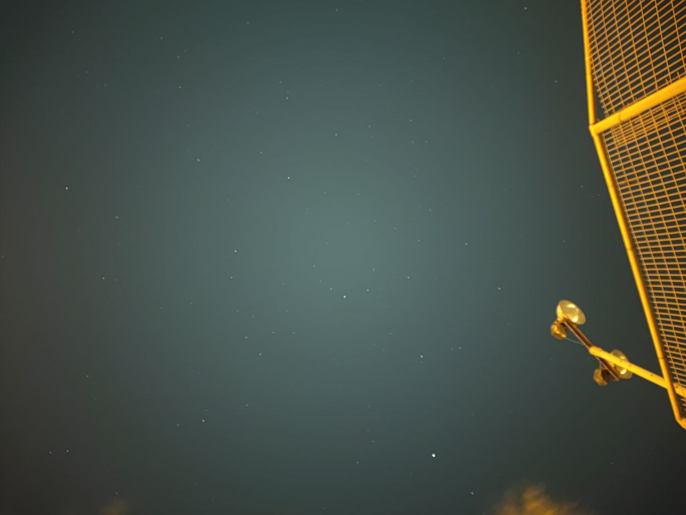
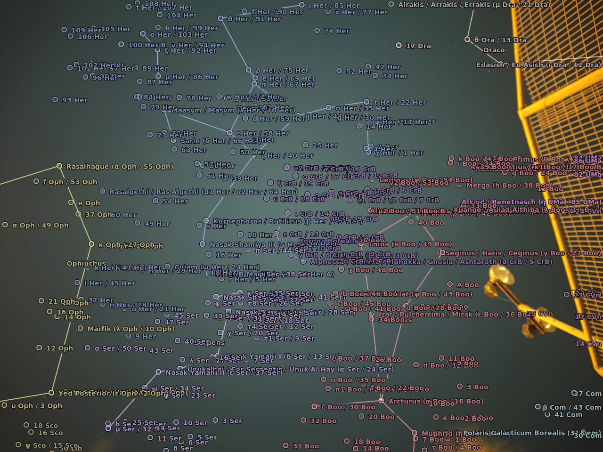
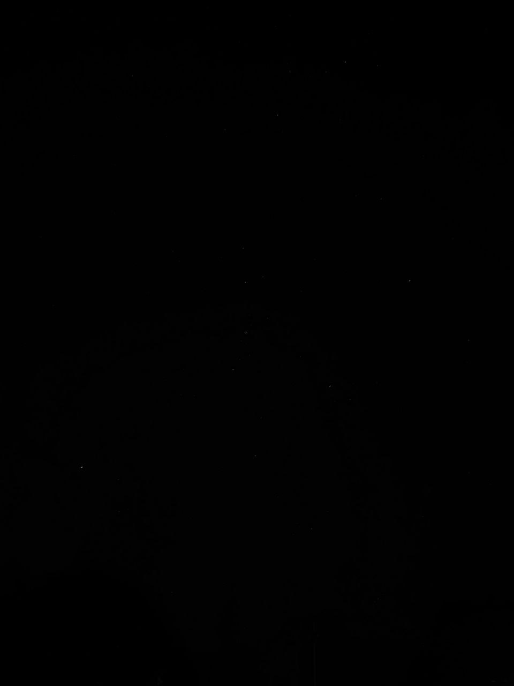
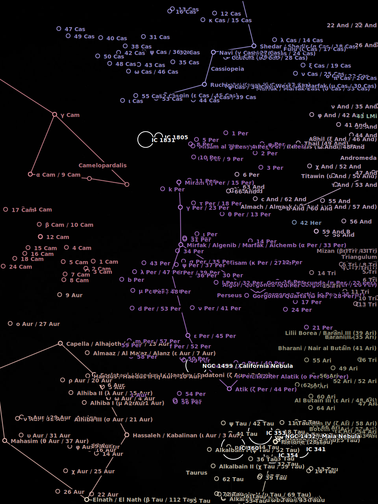

# Night Sky Photo Quality Assessment

## Overview 🌌

The quality of an average photo of the night sky is good enough for analysis. The stars captured in the images typically occupy 1-4 pixels, ensuring sufficient precision for subsequent calculations. Astromery only able to recognize stars on the photos where sky is dark enough, so there is contsrast between the sky and the stars.

## Examples 📷

Below are some example photos demonstrating the quality of night sky photography and graphical representation of their analysis via the **Astrometry**:

1.  **A clear night sky with visible stars, occupying minimal pixels, ensuring high accuracy in measurements:**

    
2.  **A night sky with some obstructions but still maintaining good star visibility:** 
    
3.  **A darker noisy image, yet still providing adequate detail for precision calculations:** 

    

## Precision Considerations 🔍

-   **Star Size:** The typical size of a star in these images is between 1-4 pixels.
    
-   **Calculation Accuracy:** Since the stars occupy a small number of pixels, the position and brightness measurements remain accurate.
    
-   **Noise and Obstructions:** While some noise and obstructions (e.g., clouds, buildings) may appear, they do not significantly impact the precision of calculations.
    

## Conclusion ✅

Given the resolution and quality of these images, they are suitable for further astronomical or scientific analysis. The small pixel footprint of the stars ensures that calculations related to position, brightness, and motion can be performed with high precision.

